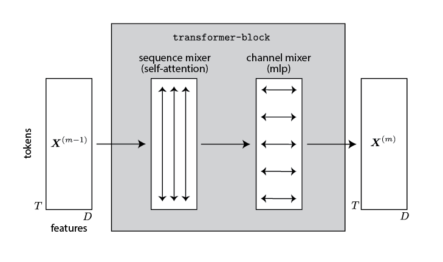
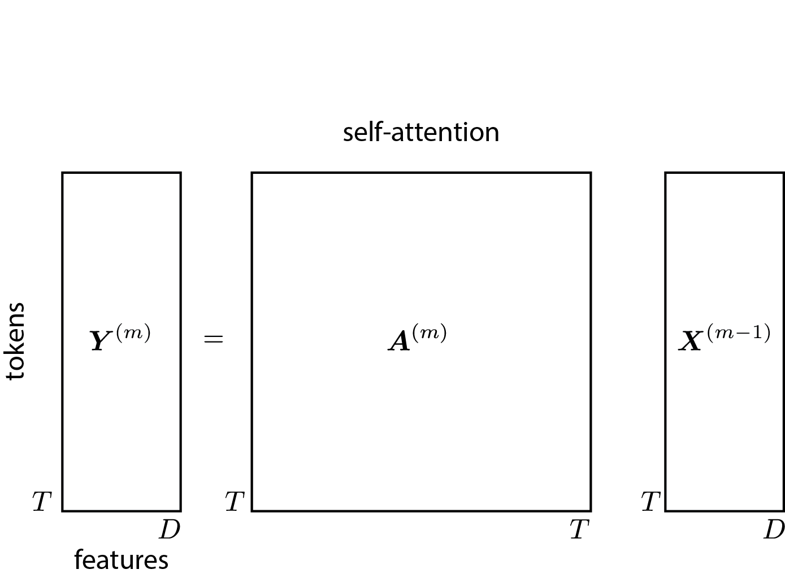
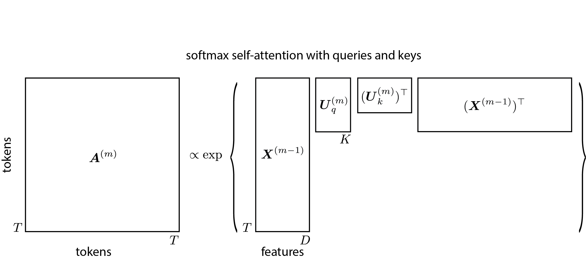
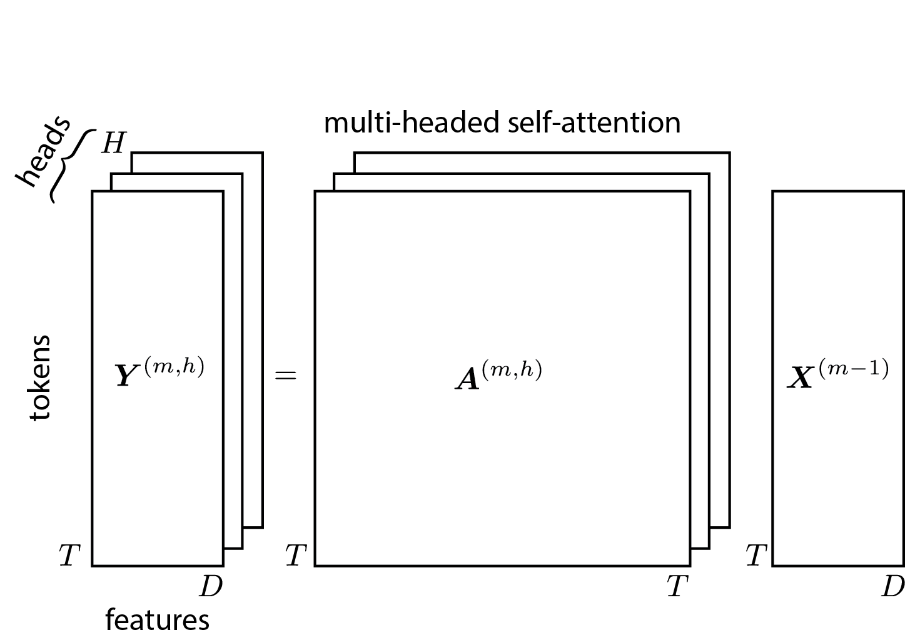
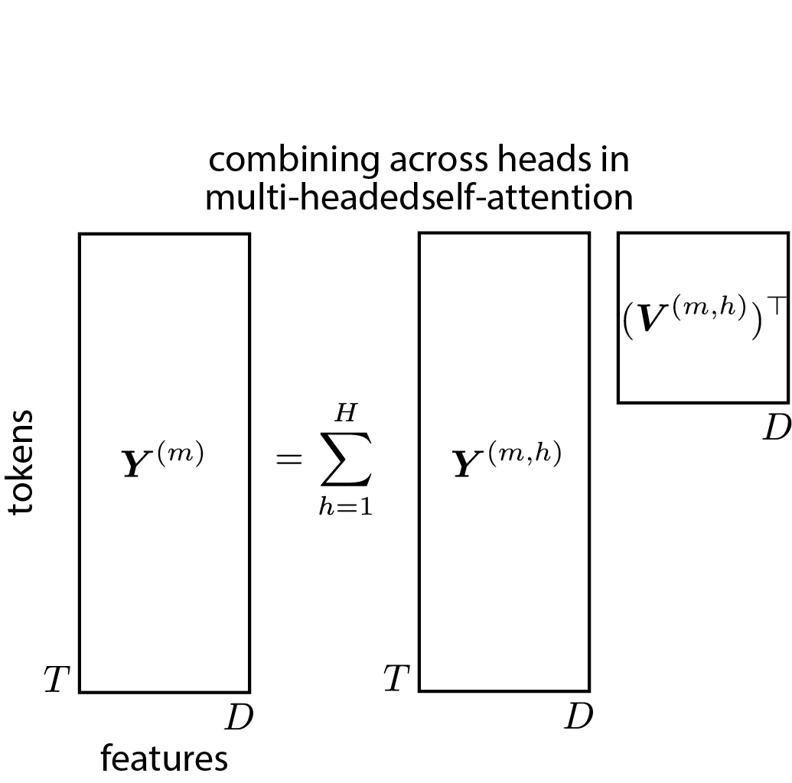
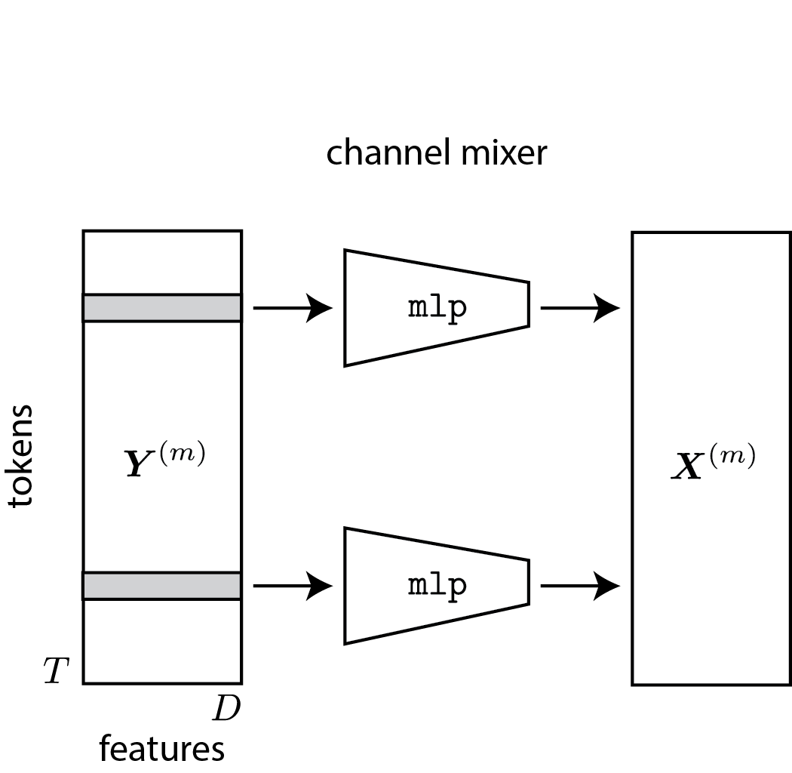
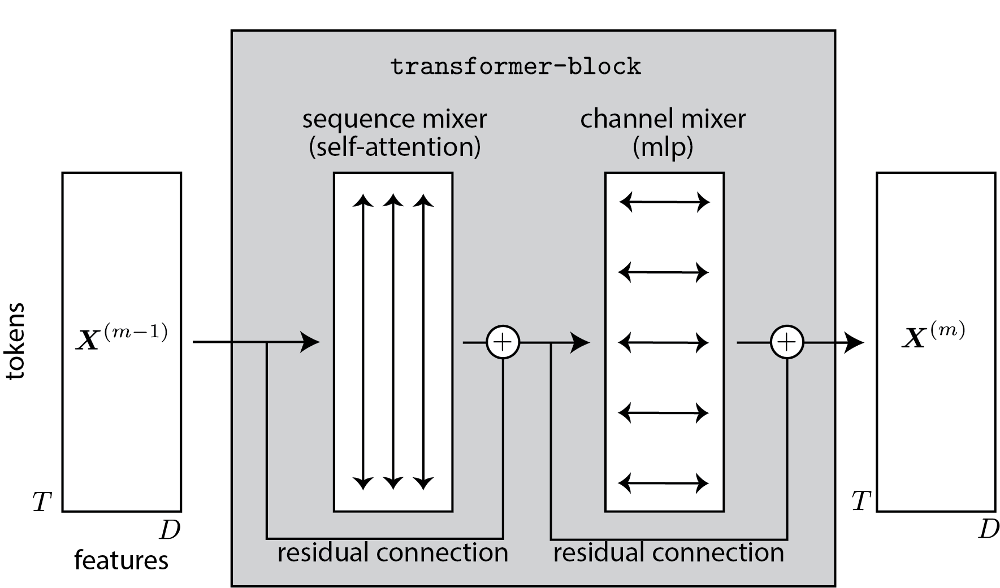

# Transformers

**Prerequisites:** This chapter builds on [Recurrent Neural Networks](04_03_rnns).

RNNs are natural models for sequential data, but the $\cO(T)$ time complexity of evaluation and backpropagating gradients is a severe limitation. In modern machine learning, one of the deciding factors is how many training epochs you can perform for a fixed computational budget. To that end, architectures that can process an entire sequence in parallel are advantageous. Transformers are one such architecture.

Transformers underlie large language models (LLMs) like Open AI's ChatGPT and Google's Gemini. They are also widely used in computer vision and other domains of machine learning. This lecture will walk through the basic building blocks of a transformer: self-attention, token-wise nonlinear transformations, layer norm, and positional encodings. We will focus on modeling sequential data. We will follow the presentation of @turner2023introduction, but we will make some slight modifications to the notation to be consistent with our previous notes and Homework 4.

## Preliminaries

Let $\mbX^{(0)} \in \reals^{T \times D}$ denote our data matrix with row $\mbx_t^{(0)} \in \reals^D$ representing the $t$-th **token** in the sequence. For example, the tokens could be a vector embedding of a word, sub-word, or character. The embeddings may be fixed or learned as part of the model.

The output of the transformer will be another matrix of the same shape, $\mbX^{(M)} \in \reals^{T \times D}$. These output features can be used for downstream tasks like sentiment classification, machine translation, or autoregressive modeling.

The output results from a stack of transformer blocks,
\begin{align*}
\mbX^{(m)} &= \texttt{transformer-block}(\mbX^{(m-1)})
\end{align*}
Each block consists of two stages: one that operates vertically, combining information across the sequence length; another that operates horizontally, combining information across feature dimensions.

## Attention

The first stage combines information across sequence length using a mechanism called **attention**. Mathematically, attention is just a weighted average,
\begin{align*}
\mbY^{(m)} &= \mbA^{(m)} \mbX^{(m-1)},
\end{align*}
where $\mbA^{(m)} \in \reals_+^{T \times T}$ is a row-stochastic attention matrix. That is, $\sum_{s} A_{ts}^{(m)} = 1$ for all $t$. Intuitively, $A_{t,s}^{(m)}$ indicates how much output location $t$ attends to input location $s$. 

When we are using transformers for autoregressive sequence modeling, we constrain the attention matrix to be **causal** by requiring $A_{t,s}^{(m)} = 0$ for all $t < s$. In other words, the matrix is **lower triangular**.

### Self-Attention

Where does the attention matrix come from? In a transformer, the attention weights are determined by the pairwise similarity of tokens in the sequence. The simplest instantiation of this idea would be something like,
\begin{align*}
A_{t,s} &\propto \exp \left\{ \mbx_t^\top \mbx_s \right\}
\end{align*}
Once normalized,
\begin{align*}
A_{t,s} &= \frac{\exp \{ \mbx_t^\top \mbx_s\}}{\sum_{s'=1}^T \exp\{\mbx_t^\top \mbx_{s'}\}}.
\end{align*}
(Note: we have dropped the superscript ${}^{(m)}$ for clarity in this section.)

This approach implies that attention depends equally on all $D$ dimensions of the embedding. In practice, some of those dimensions may convey different kinds of information that may be of greater or lesser relevance for the attention mechanism. One way to allow for this is to project the tokens into a feature space before computing the attention weights,
\begin{align*}
A_{t,s} &= \frac{\exp \{ (\mbU \mbx_t)^\top (\mbU \mbx_s)\}}{\sum_{s'=1}^T \exp\{(\mbU \mbx_t)^\top (\mbU \mbx_{s'}) \}}
\end{align*}
where $\mbU \in \reals^{K \times D}$ with $K < D$.

Still, the numerator in this attention weight is symmetric. If we think of the attention weight as specifying how relevant token $\mbx_s$ is to updating the feature representation for token $\mbx_t$, then directionality may matter. Personifying the tokens a bit, $\mbx_t$ may need to know a certain kind of information to update its representation, and $\mbx_s$ may be able to provide that information, but the converse need not be true. 

Transformers use a more general form of attention to address this asymmetry,
\begin{align*}
A_{t,s} &= \frac{\exp \{ (\mbU_q \mbx_t)^\top (\mbU_k \mbx_s)\}}{\sum_{s'=1}^T \exp\{(\mbU_q \mbx_t)^\top (\mbU_k \mbx_{s'}) \}},
\end{align*}
where $\mbU_q \mbx_t \in \reals^{K}$ are the **queries** and $\mbU_k \mbx_s \in \reals^{K}$ are the **keys**.

The parameters $\mbU_q \in \reals^{K \times D}$ and $\mbU_k \in \reals^{K \times D}$ are the two parameters defining the self-attention mechanism.

:::{admonition} Causal attention
To enforce causality in the attention layer, we simply zero out the upper triangular part of the attention matrix and normalize the rows appropriately,
\begin{align*}
A_{t,s} &= \frac{\exp \{ (\mbU_q \mbx_t)^\top (\mbU_k \mbx_s)\}}{\textcolor{red}{\sum_{s'=1}^{t}} \exp\{(\mbU_q \mbx_t)^\top (\mbU_k \mbx_{s'})\}} \cdot \bbI[t \geq s].
\end{align*}

:::

:::{admonition} Comparison to RNNs
Compare the self-attention mechanism to the information processing in an RNN. Rather than propagating information about past tokens via a hidden state, a transformer with causal attention can directly attend to any one of the past tokens.
:::

:::{admonition} Connection to Convolutional Neural Networks (CNNs)
If the attention weights were only a function of the distance between tokens, $A_{t,s} = a_{t-s}$, then the matrix $\mbA$ would be a **Toeplitz matrix**. Multiplication by a Toeplitz matrix corresponds to a discrete convolution. From this perspective, we can think of the attention mechanism in a transformer as a generalization of convolution that allows for input-dependent and time-varying filters.
:::

### Multi-Headed Self-Attention
Just as in a CNN each layer performs convolutions with a bank of filters in parallel, in a transformer each block uses a bank of $H$ **attention heads** in parallel.  Let,
\begin{align*}
\mbY^{(m,h)} &= \mbA^{(m,h)} \mbX^{(m-1)} \in \reals^{T \times D}
\end{align*} 
where 
\begin{align*}
A_{t,s}^{(m,h)} &= 
\frac{\exp \{ (\mbU_q^{(m,h)} \mbx_t^{(m-1)})^\top (\mbU_k^{(m,h)} \mbx_s^{(m-1)})\}}{\sum_{s'=1}^T \exp\{(\mbU_q^{(m,h)} \mbx_t^{(m-1)})^\top (\mbU_k^{(m,h)} \mbx_{s'}^{(m-1)}) \}},
\end{align*}
is an attention weight at layer $m$ and head $h$ for $h=1,\ldots,H$. (Now you see why we dropped superscripts above &mdash; the notation is a handful!)

The outputs of the attention heads are either concatenated or linearly combined,
\begin{align*}
\mbY^{(m)} &= \sum_{h=1}^H \mbY^{(m,h)} (\mbV^{(m,h)})^\top \\
&\triangleq \texttt{mhsa}(\mbX^{(m-1)}).
\end{align*}
where $\mbV^{(m,h)} \in \reals^{D \times D}$ is a read-out matrix for layer $m$, head $h$.
We denote the multi-headed self-attention (MHSA) mapping by $\texttt{mhsa}(\cdot)$.

:::{admonition} Queries, Keys, and Values
The original transformer paper presents the output of a single head as a set of values,
\begin{align*}
\mbY^{(m,h)} &= \mbA^{(m,h)} (\mbX^{(m-1)} (\mbU_v^{(m,h)})^\top) \in \reals^{T \times K}
\end{align*}
where $\mbU_v^{(m,h)} \in \reals^{K \times D}$ is a **value matrix**. Then the attention mechanism can be though of as taking a weighted average of **values** $\mbU_v \mbx_t$ where the weights are determined by an inner product between the queries and keys. 

The final output is projected back into the original token dimension and linearly combined,
\begin{align*}
\mbY^{(m)} &= \sum_{h=1}^H \mbY^{(m,h)} (\mbU_o^{(m,h)})^\top 
\end{align*}
where $\mbU_o^{(m,h)} \in \reals^{D \times K}$ is an **output matrix** that maps from values to new tokens.

This formulation corresponds to a low-rank read-out matrix $\mbV = \mbU_o \mbU_v^\top$, where we have again dropped the superscripts for clarity.
:::

## Token-wise Nonlinearity

After applying the multi-headed self-attention to obtain $\mbY^{(m)}$, the transformer applies a token-wise nonlinear transformation to nonlinearly mix the feature dimensions. This is done with a simple feedforward neural network, also known as a **multilayer perceptron (MLP)**,
\begin{align*}
\mbx_t^{(m)} &= \texttt{mlp}(\mby_t^{(m)})
\end{align*}
Note that the same function is applied to all positions $t$. 

:::{admonition} Computational Complexity
:class: warning
The MLP typically has hidden dimensions of at least $D$, so the computational complexity of this step is $\cO(TD^2)$. For transformers with very large featured dimensions, this can be the dominant cost.
:::

## Residual Connections

Rather than parameterizing $\mbX^{(m)}$ as the output of the MLP, a common trick in deep learning is to use residual connections. The idea is simple: when the input and output are of the same dimensionality, we can let the network learn the **residual**, which is typically smaller in magnitude than the overall funciton.

Transformers use residual connections for both the multi-headed self-attention step and the MLP. So,
\begin{align*}
\mbY^{(m)} &= \mbX^{(m-1)} + \texttt{mhsa}(\mbX^{(m-1)}) \\
\mbX^{(m)} &= \mbY^{(m)} + \texttt{mlp}(\mbY^{(m)})
\end{align*}

## Layer Norm

Finally, it is important to use other deep learning "tricks" like LayerNorm to stabilize training. In a transformer, LayerNorm amounts to z-scoring each token $\mbx_t$ and then applying a learned shift and scale to each feature dimension,
\begin{align*}
\texttt{layer-norm}(\mbx_t) 
&= \mbbeta + \mbgamma \odot \left( \frac{\mbx_t - \texttt{mean}(\mbx_t)}{\texttt{std}(\mbx_t)} \right)
\end{align*}
where
\begin{align*}
\texttt{mean}(\mbx_t) &= \frac{1}{D} \sum_{d=1}^D x_{t,d} \\
\texttt{std}(\mbx_t) &= \Big(\frac{1}{D} \sum_{d=1}^D (x_{t,d} - \texttt{mean}(\mbx_t))^2 \Big)^{\frac{1}{2}}
\end{align*}
and $\mbbeta, \mbgamma \in \reals^D$ are learned parameters.

LayerNorm is typically applied before the multi-headed self-attention and MLP steps,
\begin{align*}
\overline{\mbX}^{(m-1)} &= \texttt{layer-norm}(\mbX^{(m-1)}) \\
\mbY^{(m)} &= \overline{\mbX}^{(m-1)} + \texttt{mhsa}(\overline{\mbX}^{(m-1)}) \\
\overline{\mbY}^{(m)} &= \texttt{layer-norm}(\mbY^{(m)}) \\
\mbX^{(m)} &= \overline{\mbY}^{(m)} + \texttt{mlp}(\overline{\mbY}^{(m)})
\end{align*}
This defines one $\texttt{transformer-block}$. 

A transformer stacks $M$ $\texttt{transformer-blocks}$ on top of one another to produce a deep sequence-to-sequence model.

## Positional Encodings

Except for the lower triangular constraint on the attention matrices, the transformer architecture knows nothing about the relative positions of the tokens. Absent this constraint, the transformer essentially treats the data as an **unordered set** of tokens. This can actually be a feature! It allows the transformer to act on a wide range of datasets aside from just sequences. For example, transformers are often applied to images by chunking the image up into patches and embedding each one.

However, when the data posses some spatial or temporal structure, it is helpful to include that information in the embedding. A simple way to do so is to add position and content in the token,
\begin{align*}
\mbx_t^{(0)} &= \mbc_t + \mbp_t,
\end{align*}
where $\mbc_t \in \reals^D$ is an embedding of the content and $\mbp_t \in \reals^D$ encodes the position (e.g., with a set of sinusoidal basis functions).

## Autoregressive Modeling

To use a transformer for autoregressive modeling, we need to make predictions from the final layer's representations. If the goal is to predict the next word label $\ell_{t+1} \in \{1,\ldots,V\}$ based on encodings of past words $\mbx_{1:t}^{(0)}$, where $V$ is the vocabulary size, then we could use a categorical distribution,
\begin{align*}
\ell_{t+1} &\sim \mathrm{Cat}(\mathrm{softmax}(\mbW \mbx_t^{(M)}))
\end{align*}
where $\mbW \in \reals^{V \times D}$. Like the hidden states in an RNN, the final layer's representations $\mbx_t^{(M)}$ combine information from all tokens up to and including index $t$.

## Training

Training deep neural networks is somewhat of a dark art. Standard practice is to use the Adam optimizer with a bag of tricks including gradient clipping, learning rate annealing schedules, increasing minibatch sizes, dropout, etc. Generally, treat these algorithmic decisions as hyperparameters to be tuned. We won't try to put any details in writing lest you overfit to them.

## Conclusion

Transformers are a workhorse of modern machine learning and key to many of the impressive advances over recent years. However, there are still areas for improvement. For example, the computational cost of attention is $\cO(T^2)$, and a lot of work has gone into cutting that down. Likewise, while the transformer allows for predictions to be made in parallel across an entire sequence, sampling from the learned autoregressive model is still takes linear time. In the lectures ahead, we'll discuss other recent architectures that address some of these concerns.
